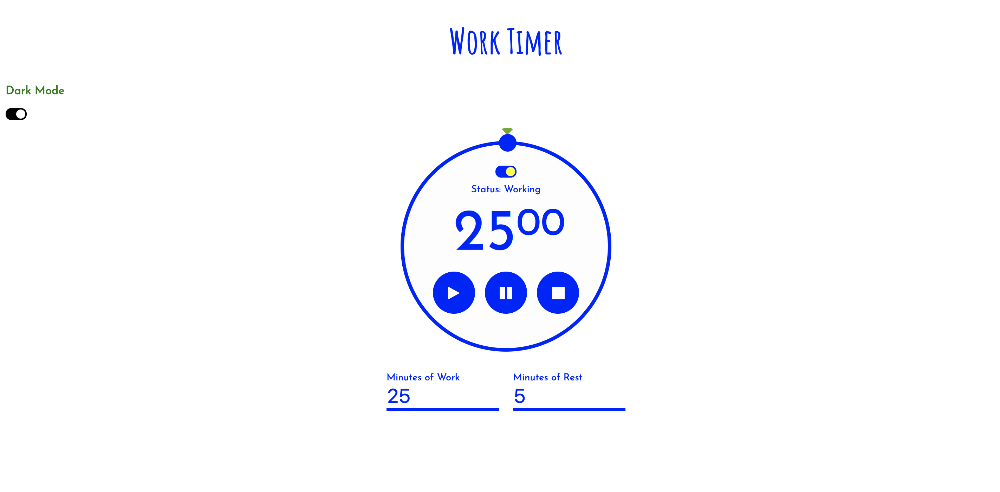

# workTimer

A simple timer application made with HTML, CSS and Javascript, to remind the user when to take a short break during work. The user can input the amount of time they wish to have working and, how long they wish to take a break in between. The application alerts the user when the timer is up, either to take a break or get back to work. The users preferences are saved in local storage and a dark/light mode is provided for enhanced user experience. Bootstrap and google fonts are also included. 

